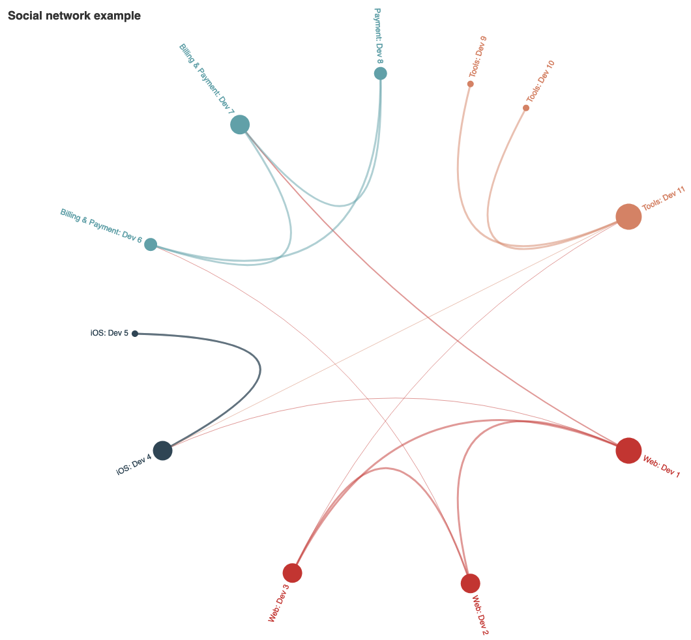
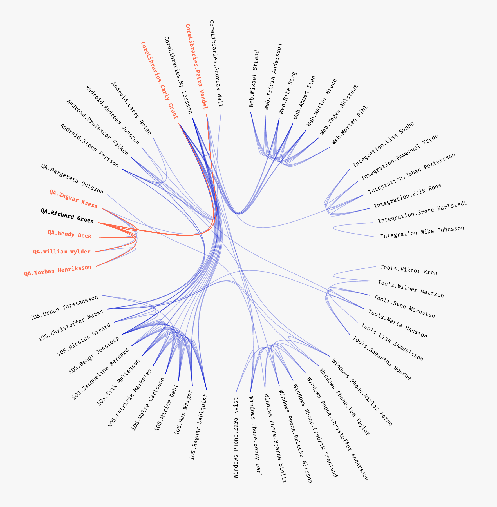
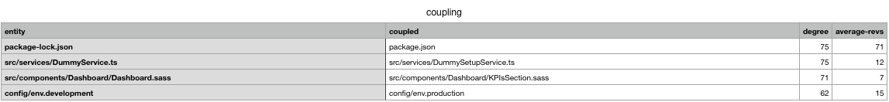

## Prequel

A talk about how Git is a treasure trove might be interesting to a lot of people. The title sounds catchy, perhaps I will tell you about a hidden treasure that you could unearth? This alone might be a good reason to listen to me. Although I think it would be only fair if everybody listening to this talk was aware of what Git is and how it is used. It does play a major role for this talk to make sense.

So here goes: Git is a **version control system**. You can use git with all kinds of digital files. I focus on using it for source code files, which are almost always fancy looking text files. You use Git to store those files in a way that earlier versions are retrievable. If something goes wrong while you write your source code, you can revert back to an earlier state. All developers working on one project or one application together use the same **repository** where the files are stored. Saving your work into Git is called **commiting**. I will talk about **commits**. Those are the **contributions** by individual members of your team. Git's history is retrievable at any point. You can always trace changes to **who did them** and **when**. Depending on your developers conventions and discipline you could even find out **why a change was made**.

I believe this short introduction into how Git works should be enough. It will help you to get the most out of my talk. One important thing to note: There are other version control systems. They have names like Subversion or Mercurial or even other names I heard and forgot again. Everything I am about to tell you where I use "Git", you could easily replace "Git" with any other system. It works everywhere. You just have to know how. 😉

## Fragmentation

Imagine holding a mirror in your hand. You look at the mirror. It's a pretty mirror with a beautiful image in the middle. Now you throw the mirror on the stone floor beneath you. The glass bursts into pieces. Some bigger shards and many, many smaller ones. It's a mess. It looked so wonderful in the beginning. Somebody has to clean it up.


Welcome to your latest software development project.

What I just told you about is called fragmentation. And this is the reality of your projects, your source code and your teams. They are fragmented. You don't know by how much — yet.

I once knew a company, they worked in the media industry. They had multiple teams of about 10-15 people each. There was the iOS team, a web-dev team and a payments team. There was a business intelligence department and a tools team (now called DevOps). These were the teams I was aware of. I believe there were even more people working on code. This company already existed for several years when I learned of them. Code was written for many years and fluctuation of team members was relatively high. A couple of people left and joined each year. A developer, let's call her Alice (Bob will make an appearance later on as well!), had written a very important part of their application. It was of high importance to the business domain with calculations and business logic and everything. Like I said, it was **IMPORTANT**! Remember what I just said about the fluctuation? Alice had left the company two years ago. She was the only one who've created that important module. It was classic legacy code — which is a code word for "it had no tests".

Of course, there were bugs in that module. And what's the common fate all bugs share? They have to be fixed! Since Alice was [AWOL](https://www.urbandictionary.com/define.php?term=AWOL)^[Absent Without Official Leave: A term used in the United States Military to describe a soldier or other military member who has left his or her post without permission (usually in disagreement with a particular order).] somebody else had to take over. The code was legacy, hard to work with and nobody wanted to take any responsibility for it. It was a software development no man's land.

I want to ask you to do me a favor: Please, for a moment, take off your developer's hat and replace it with this shiny, imaginary project-management baseball cap that I am holding in my hand. What do you see when you look at this situation with Alice and the IMPORTANT MODULE? It cannot stay that way. You want to have people responsible for this module. You want this for a single reason: You don't want to have broken windows.

### The broken windows theory


The idea behind it appears quite simple: You have a house with many windows. Somebody takes a stone and throws it through one of the windows. The window is now broken. If you don't take the time to fix the window, others will feel motivated to throw more stones and break more windows. This is because it appears as if no one cares for the house and its windows.

If we translate it so it fits a software project it becomes this: We don't want to have code/a module appear abandoned. If it appears that no one cares about bugs, code quality and standards, no one will. The module's/the project's quality will continue to degrade.

Let's come back to our IMPORTANT MODULE from Alice. You are still wearing your impressive, shiny project management baseball cap. You want somebody to fix windows.


Now who should take over this role? Do you randomly assign someone who walked past you in the hallway? Do you take your best developer from your high-paying client project and assign her the IMPORTANT MODULE? What's the best way to proceed here?

I will give the answer now. It will be the same for all the other questions I might ask you later on. If you know the title of this talk, you could already guess the answer. The answer is: You mine your Git repository. Or shorter, more placative: Ask Git.

This is what Git's answer might look like: Colored rectangles!


If you look at these rectangles you'll see some odd-looking names. These are the names of your developers who contributed code to this module during the last 9 months. The bigger the rectangle, the more commits they've made. If you take the three biggest rectangles, from Uhura, Dax and Sisko you'll see that together their contributions account to more than 50% of all changes. And there you'll have your answer. You are going to ask these three developers to take over the ownership of the module. All three are from different teams. You can see that from the color-coding. Each team gets its own color. So we also learn that, in this example, three different teams all contribute to one module. Your organizational boundaries do not seem to reflect your structural boundaries very much.

### Boundaries

This comes with a high cost: Higher risk of defects and increased communications efforts. Those teams probably do not sit close together, yet they work and commit on the same repository. Perhaps you already have a feeling for what could go wrong there, but the answer is: A lot!

Don't get me wrong: It is okay to reach a point of shared ownership over a module. That's perfectly fine if it is intentional, people are aware of the situation and you want to encourage cross-team-communication.

Let's get a feeling how it looks if we do not have any boundaries like specific teams. For that we'll have a look at a popular Open Source repository.
=> Video of Rails repo network.

These communication paths are created by developers who tend to work on the same parts of the code. The more contributions they make around the same modules and files, the stronger the links between them.







### More fragmentation

There are at least two more ideas I want to briefly talk about that concern fragmentation. The first one is about your technology. How many different technologies, programming languages, deployment techniques, project management applications, ways of documentation etc. do you use across all teams?
Consider the case of using something that maybe only few people are capable of using (old programming languages or a very obscure tech stack). What happens when these people leave the company like Alice? Are you aware what your stack is made up of across all your teams? It's called the technology sprawl. The more different tech you use, the higher the sprawl. Especially regarding programming languages, Git can help us analyze and answer this question as well. It will also tell us, **who** writes code using these languages. If one of those people is about to leave your company, you better focus on a proper offboarding and on having them write lots of docs and educate their peers.

The other point about fragmentation is this: **It doesn't matter***

*as much

It doesn't matter as much, if your code never changes. If you use old code where there is no reason to change it because it works perfectly fine the way it is, then fragmentation doesn't matter. If Alice had left us with a perfect piece of code and the business requirements for that module don't change, I wouldn't have had to talk as much the last minutes!

### The last word on fragmentation

Well I promise you, that this will be the last time that you will hear me talk about fragmentation tonight. Unless you ask me something about it, of course. 😉
The previous point touched on it already and I believe I also said it already: The analyzation of the fragmentation let's you find out who wrote the code. Analyzing can make you aware of parts of the code that too many people work on. If too many people work on the same code you have increased communication efforts. Bugs can creep into those parts since it is probable that some of the developers contributing do not have enough knowledge of the module. They might make wrong assumptions. They write code that is not "good enough" for your requirements. There are ways to mitigate those issues and your chance to catch the problems and do something about them increases when you are aware of those hotspots in your code base.

I talked about specialists using arcane languages a few minutes before. If you are aware of those "situations" you do know almost exactly what experts to look for if you have to replace somebody leaving the company. This should make writing those job board postings a bit easier for you.

## Change Coupling

Now let's switch from fragmentation to something else that Git can help us with. Before, we looked at how many people contributed to the same modules and files. Now we will talk about what they commited. When using Git you decide what makes up a commit. While this varies from developer to developer a good idea is to commit things that changed together. This let's you write a Git commit message that describes the change and why it took place. These messages are usually helpful later on when you need to find out why a certain change was introduced and what the surrounding situation was like.
There are, of course, situations where people deviate from that idea. This leaves you with commit messages like this:

```
fix
```

```
bug
```

```
sh*t dont work
```

That's why we don't look at commit messages any more. We will look at the contents of those commits, specifically the files that changed.
There is an analysis that identifies the files that change **together** when making commits. There are files that will most probably change together and where it would actually raise an eyebrow if they didn't. Those are usually files where the corresponding tests change as well. This makes sense and could hint at a problem if it were different.
If you don't omit them from your analysis files like `Gemfile` and `Gemfile.lock`, `package.json` and `(package|yarn).lock` should change together as well.
But there might be files that shouldn't change together frequently.
This extract of a larger analysis shows what I mean:



Or this one:


Now, I don't say that this is always wrong and should be avoided. What I want you to keep in mind after this talk is that these analysis can show you spots where you'll have to investigate more. There is no silver bullet to find hotspots easily, refactor them and live happily ever after. Looking at your repositories through these lenses helps you point the light at different corners where it might not have shown before.

## Summary

- Fragmentation (who actually believed I wouldn't talk about it anymore?!)
- Ownership
- Boundaries - structure - networks
- Technology sprawl
- Change coupling over time

Other things we could learn:

- Churn - how often do files change
- Code age
- Maturity/stabilization of modules

## Limitations

- don't squash commits
- mob and pair programming
- don't use this data for performance evaluations => ppl optimize for what is measured (many commits? lines of code?)


### Photos

Photo by veeterzy on Unsplash
