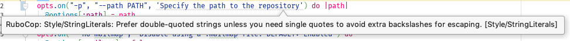

## What is a linter?

If you write code, you want you code to look a certain way. You want the syntax to meet your stylistic requirements. In the beginning, when you learn coding, you don't have much preference for a certain style. It is common to copy what you see others do. That is good. Continue doing that. After doing that for a longer while and learning to write code on your own, you might join a team.

> When a team of developers writes code, the syntax should not show the author.

When a team of developers writes code, the syntax should not show the author.  The code look the same and conform to the same rules regardless of who wrote it. A linter is a tool that helps you achieve that goal. It scans your code for deviations from the rules your team set up. You can even use it to automatically _correct_ your code.

## Why are linters necessary?

Code is read often, but written only once. It is easier for a team to read code, if it is written in one style. This includes rules on whitespace, punctuation and specifics of the language you write in. It isn't always easy to follow the rules and conform to the styleguide. A linter will warn you when you deviate from the standard and help you correct your code.

## How do you use a linter?

Linters observe the code you write, while you write it. They are integrated into your editor, or your IDE. A few editors and IDEs already bring preconfigured linters. Most of the time you have to configure the rules to match you team's rules.
When you write code that your linter does not like, you will get a notice in your editor. This is what it looks like for [Rubocop][1] in the IDE [RubyMine][2].

## Should you lint all your code?

Yes. If you want your team or other developers to work with you code, you should lint it. There are reasons to deviate from common standard coding guidelines. You might have your reasons and I won't challenge you here. Just be aware that the standard is used by the majority of developers on the majority of projects. Consider changing jobs or teams. You suddenly would be facing new guidelines. You'd have to adept your coding style. If you know the standard you can follow it more easily.

## How does linting work for teams?

The same way it works for individuals. The team comes to a conclusion on the style they want to use. This could be a standard style with some minor customizations. Next, the team writes or adepts configuration files for the linters they want to use. These are then made available to every developer to use.
If you follow my guidelines on achieving software quality, you will have a continuous integration workflow that enforces your linting rules as well.

In the end your code reads easier and looks cleaner. Don't be afraid that all code will look the same. There are still ways to [find your own handwriting style when coding][3]

[1]:	https://github.com/rubocop-hq/rubocop "Rubocop"
[2]:	https://www.jetbrains.com/ruby/ "RubyMine by Jetbrains"
[3]:	/art/ "The art of code"

