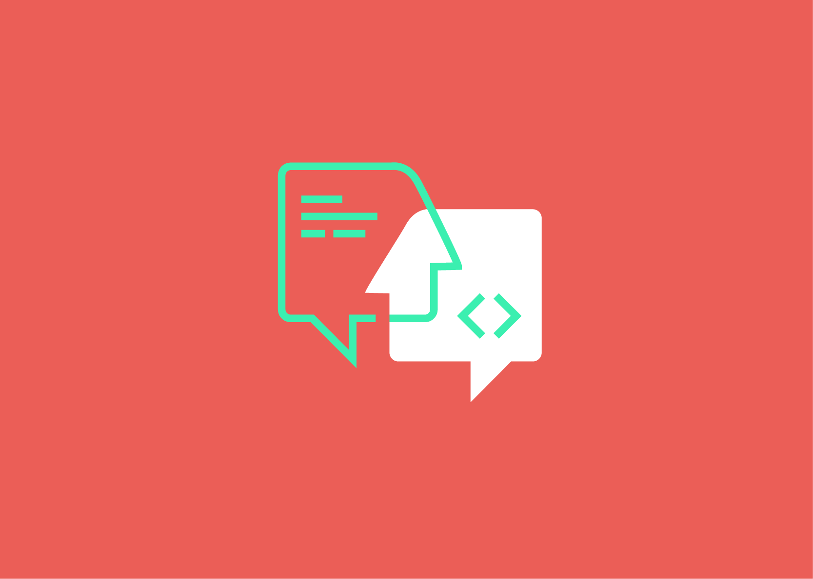

I give workshops on these topics:

### Coding retreat

A coding retreat offers the opportunity to learn as a developer and to improve one's own skills outside of the normal project routine.  
For this purpose, a different solution to a given problem is developed over and over again in several runs. The work is test-driven in pair programming. In the end, however, it is not the finished solution that counts, but the different approaches to the problem - further development is the goal. 

The day consists of 5-6 sessions with breaks. Each session’s learning builds upon previous sessions. Early sessions give the chance for new attendees to become comfortable with the problem domain, pairing habits, and basic Test-Driven Development cycle. Later session constraints challenge pairs to stretch their skills and understanding of abstractions, modular design, and test-driven development.

Participants work in pairs the entire day, and the group reforms regularly to discuss the principles of software design.

The code will be deleted after each session to provide an opportunity for the pair to apply learning from previous sessions.

##### Constraints

When building the solution to a particular problem over and over, a developer tends to converge on a single style, based on their existing skills and habits. Later sessions add constraints on either the design structure, coding or communication patterns, or the language elements used in order to expand those boundaries and introduce new concepts. This can be as simple as changing the amount of code developer may write (can you make all functions only three statements long?), or as broad as extending the problem domain to show tradeoffs in design strategy (can you make your two-dimensional code work in 3D?). The developer might be required to begin their session working on (legacy) code from a previous session. Prohibiting the use of conditionals might be another constraint.

##### Previous knowledge

- Practical experience building software
- Experience doing test-driven development
- Openess to new challenges

##### Learning objectives
Participants typically leave the day with new inspiration for the challenges they face in their job.
They practice communication skills overcome challenges, learn from each other all while using a framework for continous learning how to build software better.

Attendees: 4-8  
Length: 1 day, 8 hours  
Location: On-site  

### Development containers / GitHub Codespaces

If you take GitHub's Codespaces, GitPod, VSCode Dev Containers or other solutions, one thing becomes apparent: Development environments based on Docker containers with a high level of integration in your IDE of choice make many things easier &mdash; whether remotely or locally on your computer.

However, getting to a running configuration is not always easy! Especially if you have to integrate many services like databases, search providers, email gateways and others.  

This workshop teaches the basics to be able to set up appropriate development environments independently. For this purpose we use different scenarios/repositories and complete the configuration files. The different available providers/options will be compared practically.

##### Previous knowledge

- Basic knowledge using Docker  
- The interest in containerized development environments  
- Ideally own projects where Dev Containers are to be implemented

##### Learning objectives
Participants will be able to create Dev Containers for their own projects and will know which of the available vendors and solution approaches is most optimal for them.

Attendees: up to 24  
Length: 1 day, 8 hours  
Location: On-site  
