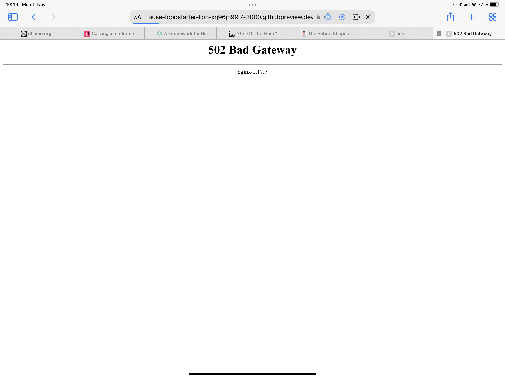
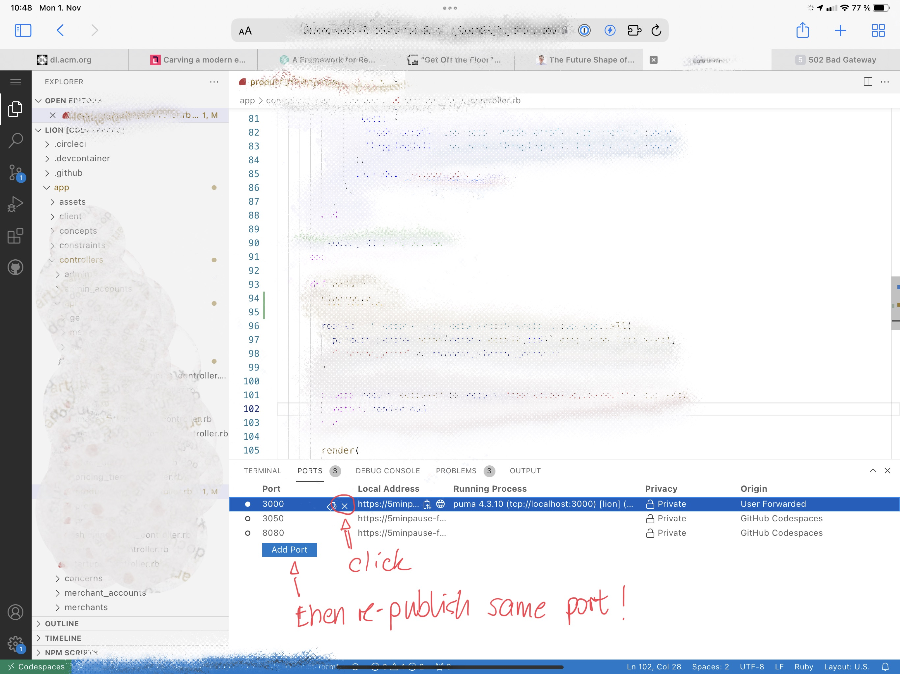

GitHub codespaces is a great feature by GitHub that let's me work on an iPad way easier than it was before.
It's also cool for teams to quickly setup a new developer, of switch between branches.

I use it for Ruby on Rails development, mostly. Sometimes a thing happens that prevents me from continuing
my work and I had trouble finding out how best to solve this. Here's what happens:
I start my codespace and want to spin up a Rails server, to inspect the website.
Once I type `bin/rails s` the server starts and I get the notification to open up the browser in a new tab.
When I navigate there, I see this screen:

It's a message from nginx that tells me that there is a 502 Bad Gateway error when I want to access my codespace.

The solution that always helps me is to unpublish the port and re-publish it again.
Here's how that looks in the interface:

That should solve your issue and you can quickly access the website.